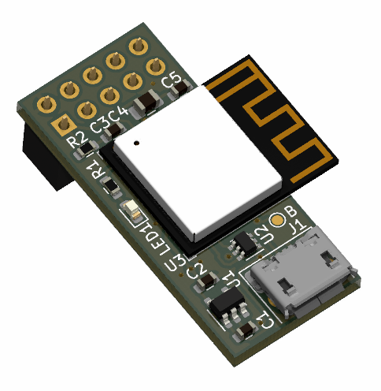

# WiFi/Bluetooth communication board based on ESP32-C3 for UEXT connector

 First boards tested, some issues might still be open.

Schematic: [PDF file](build/uext-esp32-c3.pdf)

Bill of Materials: [CSV file](build/uext-esp32-c3_bom.csv) or [interactive HTML BOM](https://libre.solar/uext-esp32-c3/build/uext-esp32-c3_ibom.html)

## Features

- UEXT connector to communicate with host MCU via UART
- Flashing via built-in USB port
- Internal power supply for firmware upgrades

## Firmware

This board can be programmed with [Zephyr RTOS](https://docs.zephyrproject.org/latest/) or [ESP-IDF](https://docs.espressif.com/projects/esp-idf/en/latest/esp32c3/get-started/index.html).

## License

The hardware is licensed under the [CERN Open Hardware Licence Version 2 - Weakly Reciprocal](LICENCE).

Documentation is licensed under the [Creative Commons Attribution-ShareAlike 4.0 International (CC BY-SA 4.0) License](https://creativecommons.org/licenses/by-sa/4.0/).
